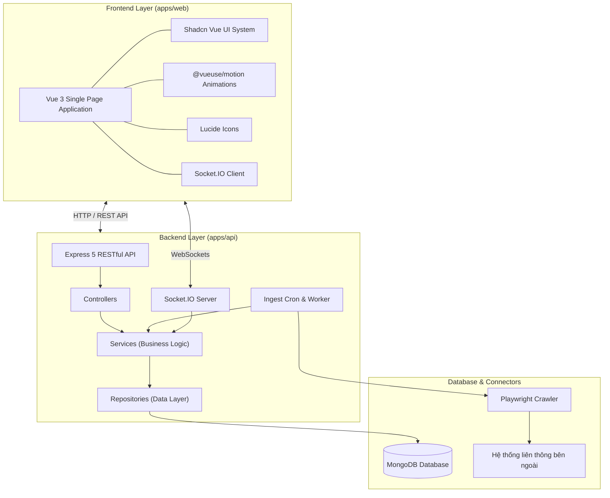

# DỰ ÁN SCMAGER / EWORK: SPECIFICATION & FUNCTIONAL REQUIREMENTS (FR)

> **Tài liệu Đặc tả Kỹ thuật & Yêu cầu Chức năng Toàn diện (System Specification & Functional Requirements)**  
> **Dự án:** eWork / SCMager  
> **Phiên bản:** 1.0.0  
> **Cập nhật:** 2026-07-27  
> **Môi trường:** Monorepo (`pnpm` + `Turbo`)

---

## MỤC LỤC
1. [TỔNG QUAN HỆ THỐNG & KIẾN TRÚC](#1-t%E1%BB%95ng-quan-h%E1%BB%87-th%E1%BB%91ng--ki%E1%BA%BFn-tr%C3%BAc)
2. [DANH MỤC DATA MODELS & ENTITIES](#2-danh-m%E1%BB%A5c-data-models--entities)
3. [ĐẶC TẢ YÊU CẦU CHỨC NĂNG (FUNCTIONAL REQUIREMENTS - FR)](#3-%C4%91%E1%BA%B7c-t%E1%BA%A3-y%C3%AAu-c%E1%BA%A7u-ch%E1%BB%A9c-n%C4%83ng-functional-requirements---fr)
   - [FR-01: Phân hệ Quản lý & Dự chiếu Văn bản (Office Documents)](#fr-01-ph%C3%A2n-h%E1%BB%87-qu%E1%BA%A3n-l%C3%BD--d%E1%BB%B1-chi%E1%BA%BFu-v%C6%83n-b%E1%BA%A3n-office-documents)
   - [FR-02: Phân hệ Quản lý Nhiệm vụ & AI Task Assignment](#fr-02-ph%C3%A2n-h%E1%BB%87-qu%E1%BA%A3n-l%C3%BD-nhi%E1%BB%87m-v%E1%BB%A5--ai-task-assignment)
   - [FR-03: Phân hệ Khai báo Công việc & Chấm công (Work Declaration & Timesheet)](#fr-03-ph%C3%A2n-h%E1%BB%87-khai-b%C3%A1o-c%C3%B4ng-vi%E1%BB%87c--ch%E1%BA%A5m-c%C3%B4ng-work-declaration--timesheet)
   - [FR-04: Phân hệ Đánh giá Hiệu suất & KPI Analytics](#fr-04-ph%C3%A2n-h%E1%BB%87-%C4%91%C3%A1nh-gi%C3%A1-hi%E1%BB%87u-su%E1%BA%A5t--kpi-analytics)
   - [FR-05: Phân hệ Tích hợp & Ingest Engine (Data Connectors)](#fr-05-ph%C3%A2n-h%E1%BB%87-t%C3%ADch-h%E1%BB%A3p--ingest-engine-data-connectors)
   - [FR-06: Phân hệ Quản trị Hệ thống & Phân quyền (Admin Governance)](#fr-06-ph%C3%A2n-h%E1%BB%87-qu%E1%BA%A3n-tr%E1%BB%8B-h%E1%BB%87-th%E1%BB%91ng--ph%C3%A2n-quy%E1%BB%81n-admin-governance)
   - [FR-07: Phân hệ Thông báo & Realtime (Realtime Engine)](#fr-07-ph%C3%A2n-h%E1%BB%87-th%C3%B4ng-b%C3%A1o--realtime-realtime-engine)
4. [ĐẶC TẢ YÊU CẦU PHI CHỨC NĂNG (NON-FUNCTIONAL REQUIREMENTS - NFR)](#4-%C4%91%E1%BA%B7c-t%E1%BA%A3-y%C3%AAu-c%E1%BA%A7u-phi-ch%E1%BB%A9c-n%C4%83ng-non-functional-requirements---nfr)
5. [QUY CHUẨN MÃ NGUỒN & HƯỚNG DẪN TRIỂN KHAI](#5-quy-chu%E1%BA%A9n-m%C3%A3-ngu%E1%BB%93n--h%C6%B0%E1%BB%9Bng-d%E1%BA%A5n-tri%E1%BB%83n-khai)

---

## 1. TỔNG QUAN HỆ THỐNG & KIẾN TRÚC

### 1.1. Giới thiệu
**eWork / SCMager** là nền tảng quản trị công việc thông minh dành cho doanh nghiệp và cơ quan hành chính. Hệ thống tự động hóa toàn bộ vòng đời công việc: từ tiếp nhận văn bản hành chính, trích xuất thời hạn và chỉ đạo của lãnh đạo bằng AI, phân công nhiệm vụ tối ưu theo năng lực cán bộ, ghi nhận báo cáo công việc hàng ngày, chấm công tự động cho đến đánh giá hiệu suất (KPI) trực quan.

### 1.2. Sơ đồ Kiến trúc Tổng thể (Architecture Diagram)



---

## 2. DANH MỤC DATA MODELS & ENTITIES

Hệ thống được thiết kế với 26 Schemas / Models chính trong MongoDB:

| STT | Entity Model | File Path | Mô tả chức năng |
| :--- | :--- | :--- | :--- |
| 1 | `User` | `apps/api/src/models/user.model.ts` | Tài khoản người dùng, thông tin cá nhân, vai trò, phòng ban, mật khẩu mã hóa, trạng thái. |
| 2 | `Role` | `apps/api/src/models/role.model.ts` | Vai trò và ma trận phân quyền hệ thống (RBAC). |
| 3 | `Organization` | `apps/api/src/models/organization.model.ts` | Cấp tổ chức / cơ quan trong mô hình doanh nghiệp đa cấp. |
| 4 | `Department` | `apps/api/src/models/department.model.ts` | Cơ cấu phòng ban / đơn vị trực thuộc tổ chức. |
| 5 | `OfficeDocumentContext` | `apps/api/src/models/office-document-context.model.ts` | Hồ sơ văn bản đến/đi, số trích yếu, số ký hiệu, cơ quan ban hành, hạn xử lý, luồng chỉ đạo. |
| 6 | `Task` | `apps/api/src/models/task.model.ts` | Nhiệm vụ/Công việc chi tiết, người giao, người chủ trì, người phối hợp, thời hạn, trạng thái. |
| 7 | `AITaskDraft` | `apps/api/src/models/ai-task-draft.model.ts` | Dự thảo nhiệm vụ do AI đề xuất trích xuất từ văn bản. |
| 8 | `AIJob` | `apps/api/src/models/ai-job.model.ts` | Tiến trình background xử lý AI trích xuất dữ liệu. |
| 9 | `WorkDeclaration` | `apps/api/src/models/work-declaration.model.ts` | Khai báo tiến độ công việc hàng ngày của nhân viên, số giờ làm việc, tài liệu chứng minh. |
| 10 | `Timesheet` | `apps/api/src/models/timesheet.model.ts` | Bảng chấm công tổng hợp theo tháng/tuần. |
| 11 | `Connector` | `apps/api/src/models/connector.model.ts` | Cấu hình nguồn kết nối tích hợp dữ liệu bên ngoài. |
| 12 | `ConnectorMapping` | `apps/api/src/models/connector-mapping.model.ts` | Ánh xạ trường dữ liệu giữa hệ thống ngoài và eWork. |
| 13 | `IngestJob` | `apps/api/src/models/ingest-job.model.ts` | Lịch trình thu thập dữ liệu tự động (Cron Ingest). |
| 14 | `IngestRun` | `apps/api/src/models/ingest-run.model.ts` | Lịch sử các lần thực thi cào/đồng bộ dữ liệu. |
| 15 | `DeadLetter` | `apps/api/src/models/dead-letter.model.ts` | Hàng chờ chứa các dữ liệu thu thập bị lỗi cần xử lý lại. |
| 16 | `MigrationQuarantine` | `apps/api/src/models/migration-quarantine.model.ts` | Bản ghi cách ly dữ liệu trong quá trình chuyển đổi. |
| 17 | `AuditLog` | `apps/api/src/models/audit-log.model.ts` | Nhật ký ghi vết mọi hành vi thay đổi dữ liệu của người dùng. |
| 18 | `GovernancePolicy` | `apps/api/src/models/governance-policy.model.ts` | Chính sách quản trị dữ liệu và bảo mật. |
| 19 | `WorkPolicy` | `apps/api/src/models/work-policy.model.ts` | Quy định giờ làm việc, hạn chót báo cáo và chính sách công việc. |
| 20 | `Notification` | `apps/api/src/models/notification.model.ts` | Thông báo gửi tới người dùng (realtime/email). |
| 21 | `ChatSession` | `apps/api/src/models/chat-session.model.ts` | Phiên trò chuyện trợ lý AI / thảo luận công việc. |
| 22 | `ChatContent` | `apps/api/src/models/chat-content.model.ts` | Chi tiết nội dung tin nhắn trao đổi trong phiên. |
| 23 | `Config` | `apps/api/src/models/config.model.ts` | Cấu hình tham số hệ thống chung. |
| 24 | `FileAttachment` | `apps/api/src/models/file-attachment.model.ts` | Quản lý tệp tin đính kèm (PDF, DOCX, Images). |

---

## 3. ĐẶC TẢ YÊU CẦU CHỨC NĂNG (FUNCTIONAL REQUIREMENTS - FR)

### FR-01: Phân hệ Quản lý & Dự chiếu Văn bản (Office Documents)

#### **FR-01.1: Quản lý Văn bản Đến & Văn bản Đi**
- **Mô tả:** Tiếp nhận, vào sổ văn bản, lưu trữ và tra cứu toàn bộ Văn bản Đến và Văn bản Đi của cơ quan/doanh nghiệp.
- **Yêu cầu chi tiết:**
  - Lập sổ văn bản điện tử với đầy đủ thông tin: Số ký hiệu, Ngày ban hành, Cơ quan ban hành, Trích yếu nội dung, Loại văn bản, Mức độ khẩn.
  - Cho phép đính kèm tệp tin tài liệu (PDF, DOCX) và xem trực tuyến.
  - Tìm kiếm toàn văn (Full-text search) theo trích yếu, số ký hiệu hoặc thời gian.

#### **FR-01.2: Trích xuất Chỉ đạo & Thời hạn Xử lý (Deadline Intake)**
- **Mô tả:** Tự động hoặc thủ công phân tích nội dung trích yếu để lấy ra thời hạn hoàn thành (Deadline) và ý kiến chỉ đạo của Lãnh đạo.
- **Yêu cầu chi tiết:**
  - Xác định cán bộ chủ trì thụ lý văn bản và cán bộ phối hợp.
  - Thiết lập cảnh báo mốc thời gian hạn xử lý (sắp hết hạn, quá hạn).

#### **FR-01.3: Động cơ Dự chiếu Văn bản (Office Document Projection Engine)**
- **Mô tả:** Chuyển đổi dữ liệu văn bản hành chính thành các Nhiệm vụ (Tasks) tương ứng một cách tự động.
- **Yêu cầu chi tiết:**
  - Khi một văn bản có chỉ đạo giao việc được duyệt, hệ thống tự động tạo ra một hoặc nhiều `Task` liên kết trực tiếp với `OfficeDocumentContext` đó (`office-document-projection.service.ts`).
  - Cập nhật trạng thái văn bản tự động khi tất cả nhiệm vụ chiếu từ văn bản đó hoàn thành.

---

### FR-02: Phân hệ Quản lý Nhiệm vụ & AI Task Assignment

#### **FR-02.1: Quản lý Vòng đời Nhiệm vụ (Task Lifecycle Management)**
- **Mô tả:** Cho phép tạo, phân công, theo dõi và nghiệm thu nhiệm vụ.
- **Yêu cầu chi tiết:**
  - Quản lý trạng thái nhiệm vụ: `Pending` (Chờ xử lý), `In Progress` (Đang thực hiện), `Completed` (Hoàn thành), `Overdue` (Quá hạn), `Cancelled` (Đã hủy).
  - Phân rõ vai trò: Người giao việc (Assigner), Người chủ trì (Assignee/Owner), Người phối hợp (Collaborators).
  - Hiển thị danh sách nhiệm vụ đa dạng góc nhìn: Dạng Bảng (Table), Dạng Thẻ (Kanban Board), Dạng Lịch (Calendar View).

#### **FR-02.2: Động cơ Phân công Thông minh AI (AI Task Assignment Engine)**
- **Mô tả:** Phân tích khối lượng công việc hiện tại và năng lực của từng nhân viên để đưa ra gợi ý phân công tối ưu.
- **Yêu cầu chi tiết:**
  - API `assignment-ai.route.ts`: Phân tích tải công việc (Workload Balance) của các nhân sự trong phòng ban.
  - Đề xuất thứ tự ưu tiên nhân sự phù hợp nhất cho nhiệm vụ mới để tránh tình trạng quá tải cục bộ.

#### **FR-02.3: Giám sát Tiến độ & Cảnh báo Quá hạn**
- **Mô tả:** Tự động tính toán tỷ lệ % hoàn thành công việc và gửi cảnh báo khi nhiệm vụ tiến gần deadline hoặc đã quá hạn.

---

### FR-03: Phân hệ Khai báo Công việc & Chấm công (Work Declaration & Timesheet)

#### **FR-03.1: Khai báo Nhật ký Công việc Hàng ngày (Daily Work Declaration)**
- **Mô tả:** Nhân viên thực hiện khai báo khối lượng công việc đã làm trong ngày.
- **Yêu cầu chi tiết:**
  - Chọn nhiệm vụ tương ứng hoặc nhập nội dung công việc phát sinh.
  - Nhập số giờ làm việc thực tế (Actual Hours spent).
  - Đính kèm bằng chứng/tài liệu sản phẩm hoàn thành.

#### **FR-03.2: Quy trình Phê duyệt Khai báo (Approval Workflow)**
- **Mô tả:** Trưởng phòng / Quản lý kiểm tra và duyệt báo cáo công việc của cấp dưới.
- **Yêu cầu chi tiết:**
  - Trưởng phòng có thể `Approve` (Duyệt) hoặc `Reject` (Từ chối / Yêu cầu giải trình lại).
  - Cập nhật tự động tiến độ % của Nhiệm vụ tương ứng sau khi khai báo được phê duyệt.

#### **FR-03.3: Tự động Tổng hợp Bảng chấm công (Timesheet Aggregation)**
- **Mô tả:** Tự động quy đổi các khai báo công việc hợp lệ thành dữ liệu chấm công `Timesheet` theo tuần/tháng cho toàn bộ nhân sự.

---

### FR-04: Phân hệ Đánh giá Hiệu suất & KPI Analytics

#### **FR-04.1: Thuật toán Tính Điểm Hiệu suất (KPI)**
- **Mô tả:** Tự động tính điểm KPI của nhân viên dựa trên các văn bản và công việc được giao (`kpi.service.ts` & `performance.service.ts`).
- **Quy tắc tính điểm:**
  1. **Điểm gốc:** Điểm giao ban đầu của văn bản hoặc điểm khai báo công việc được duyệt.
  2. **Quy tắc trừ điểm (Trừ 25% mỗi vi phạm):**
     - Bị trả lại / yêu cầu làm lại: **Trừ 25%** điểm gốc cho mỗi lần.
     - Trễ hạn làm việc: **Trừ 25%** điểm gốc cho mỗi ngày trễ.
  3. **Điểm KPI thực nhận:**
     - Công việc **chưa xong**: `0 điểm` (chuyển vào điểm chờ).
     - Công việc **đã xong**: `Điểm thực nhận = Điểm gốc - (Số lần trả lại × 25%) - (Số ngày trễ × 25%)` (Điểm tối thiểu = 0).
- **Chỉ số KPI tổng hợp:**
  - **Điểm đạt được:** Tổng điểm của các công việc đã hoàn thành.
  - **Điểm chờ:** Tổng điểm gốc của các công việc đang làm.
  - **Điểm dự kiến:** Điểm đạt được + Điểm chờ.

#### **FR-04.2: Báo cáo Thống kê Dashboard (Executive Dashboard)**
- **Mô tả:** Cung cấp biểu đồ trực quan cho Ban Lãnh đạo theo dõi sức khỏe vận hành của đơn vị.
- **Yêu cầu chi tiết:**
  - Biểu đồ tỷ lệ hoàn thành công việc đúng hạn / quá hạn (`documentStatus`: `COMPLETED`, `IN_PROGRESS`, `OVERDUE`).
  - Biểu đồ thống kê điểm KPI ghi nhận và điểm dự kiến theo từng cán bộ/phòng ban.
  - Bảng xếp hạng hiệu suất cán bộ (Top Performers).
  - Thống kê văn bản đến/đi cần xử lý tồn đọng.

---

### FR-05: Phân hệ Tích hợp & Ingest Engine (Data Connectors)

#### **FR-05.1: Thu thập Văn bản Liên thông Tự động (Automated Document Crawler)**
- **Mô tả:** Tự động kết nối tới các hệ thống điều hành văn bản bên ngoài (ví dụ: Cổng thông tin Tỉnh/Bộ) để cào dữ liệu văn bản về eWork.
- **Yêu cầu chi tiết:**
  - Sử dụng Playwright / Axios với cơ chế duy trì session (Cookiejar).
  - Thiết lập lịch trình thu thập tự động dạng Cron Job (`ingest-cron.route.ts`).

#### **FR-05.2: Quản lý Hàng chờ Lỗi (DeadLetter Queue & Quarantine)**
- **Mô tả:** Lưu trữ các bản ghi thu thập bị lỗi cấu trúc hoặc lỗi mạng để quản trị viên kiểm tra và chạy lại (`DeadLetter` & `MigrationQuarantine`).

---

### FR-06: Phân hệ Quản trị Hệ thống & Phân quyền (Admin Governance)

#### **FR-06.1: Quản lý Cơ cấu Tổ chức & Phòng ban**
- **Mô tả:** Quản lý sơ đồ cây tổ chức (`Organization`) và danh sách các đơn vị phòng ban (`Department`).

#### **FR-06.2: Quản lý Người dùng & Phân quyền Role-based (RBAC)**
- **Mô tả:** Tạo mới, chỉnh sửa, vô hiệu hóa tài khoản người dùng (`User`).
- Gán vai trò (`Role`): Quản trị hệ thống (Admin), Lãnh đạo (Director), Trưởng phòng (Manager), Nhân viên (Employee).

#### **FR-06.3: Nhật ký Truy vết Thao tác (Audit Log)**
- **Mô tả:** Ghi nhận tự động vết thay đổi (Audit Log) cho mọi hành động Thêm/Sửa/Xóa dữ liệu quan trọng để phục vụ bảo mật và thanh tra.

---

### FR-07: Phân hệ Thông báo & Realtime (Realtime Engine)

#### **FR-07.1: Thông báo Đẩy Realtime qua Socket.IO**
- **Mô tả:** Gửi tức thì các sự kiện quan trọng tới người dùng mà không cần reload trang.
- **Các sự kiện realtime:** Có văn bản mới phân công, Nhiệm vụ mới được giao, Khai báo công việc được duyệt, Cảnh báo nhiệm vụ quá hạn.

#### **FR-07.2: Quản lý Danh sách Thông báo**
- **Mô tả:** Hiển thị trung tâm thông báo (Notification Center), hỗ trợ đánh dấu đã đọc / chưa đọc.

---

## 4. ĐẶC TẢ YÊU CẦU PHI CHỨC NĂNG (NON-FUNCTIONAL REQUIREMENTS - NFR)

### NFR-01: Hiệu năng & Khả năng mở rộng (Performance & Scalability)
- API response time $\le 300\text{ms}$ cho các tác vụ thông thường.
- Hỗ trợ xử lý đồng thời (Concurrency) tối thiểu 500 kết nối Socket.IO realtime.

### NFR-02: Bảo mật & An toàn Dữ liệu (Security)
- Mã hóa mật khẩu bằng thuật toán Hash an toàn (Bcrypt/Argon2).
- Xác thực API thông qua JSON Web Token (JWT) truyền qua Header `Authorization: Bearer <token>`.
- Ngăn chặn triệt để các lỗ hổng OWASP Top 10 (NoSQL Injection, XSS, CSRF).

### NFR-03: Chuẩn Giao diện & Trải nghiệm Người dùng (UI/UX Standards)
- **Component System:** Bắt buộc dùng Shadcn Vue Components.
- **Icons & Animation:** Sử dụng Lucide Icons và hiệu ứng chuyển động mượt `@vueuse/motion`.
- **Thiết kế Nút bấm & Control:**
  - Tất cả các nút bấm (`Button`) trong hệ thống bắt buộc được bo tròn góc.
  - Các thuộc tính bật/tắt trạng thái (Active/Inactive, Enable/Disable) bắt buộc dùng Switch Button.
- **Responsive Layout:** Tối ưu hiển thị chuẩn trên cả màn hình Desktop và Mobile/Tablet.

---

## 5. QUY CHUẨN MÃ NGUỒN & HƯỚNG DẪN TRIỂN KHAI

### 5.1. Quy chuẩn Cấu trúc Dự án (Layered Architecture)
```
apps/api/src/
├── controllers/       # Tiếp nhận req, res và trả về HTTP response
├── services/          # Chứa toàn bộ nghiệp vụ xử lý (Business Logic)
├── repositories/      # Thao tác trực tiếp với cơ sở dữ liệu MongoDB
├── models/            # Khai báo Mongoose Schemas & TypeScript Types
├── routes/            # Khai báo các endpoints RESTful API
├── middlewares/       # Middleware xác thực JWT, phân quyền, validate
└── realtime/          # Socket.IO Event Handlers
```

### 5.2. Hướng dẫn Lệnh Chạy & Build
1. **Khởi chạy môi trường phát triển (Dev):**
   ```bash
   pnpm dev
   ```
2. **Chạy kiểm thử tự động (Automated Testing):**
   ```bash
   pnpm test
   ```
3. **Biên dịch & Đóng gói Production (Build):**
   ```bash
   pnpm build
   ```

---
*Tài liệu Đặc tả Kỹ thuật & Yêu cầu Chức năng (SPEC & FR) được đóng gói và xác nhận hoàn tất cho Sprint hiện tại.*
