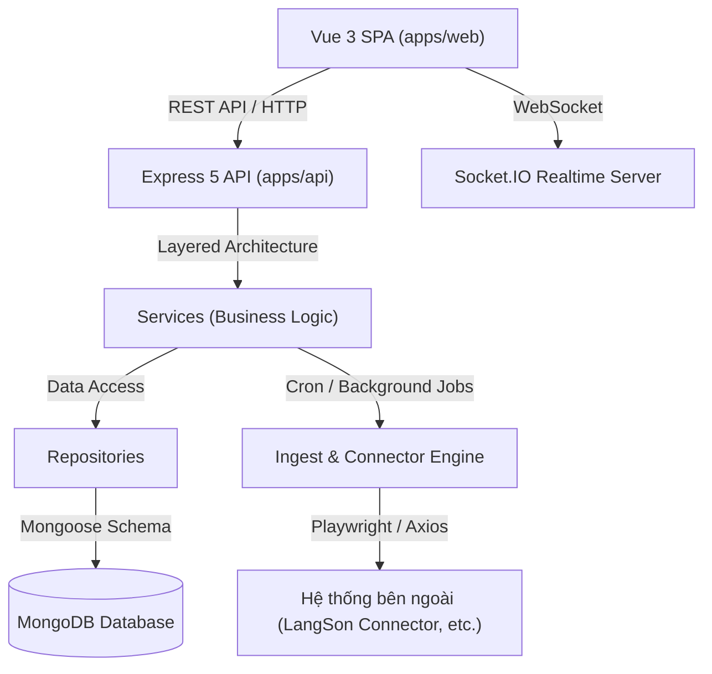

# SYSTEM SPECIFICATION DOCUMENT - EWORK / SCMAGER

> **Hệ thống Quản lý Công việc, Văn bản & Hiệu suất Doanh nghiệp (eWork / SCMager System Specification)**  
> **Phiên bản:** 1.0.0  
> **Kiến trúc:** Monorepo (`pnpm` + `Turbo`)

---

## 1. TỔNG QUAN HỆ THỐNG (SYSTEM OVERVIEW)

### 1.1. Mục đích
**eWork / SCMager** là hệ thống quản lý công việc và chỉ đạo điều hành tích hợp xử lý văn bản hành chính (Văn bản Đến, Văn bản Đi), tự động hóa phân công công việc bằng AI, theo dõi báo cáo khai báo công việc (Work Declaration), chấm công (Timesheet), đánh giá hiệu suất (KPI & Performance Analytics) và đồng bộ dữ liệu liên thông với các hệ thống bên ngoài thông qua Connector / Ingest Engine.

### 1.2. Kiến trúc tổng thể
Hệ thống được tổ chức theo mô hình **Monorepo**:
- `apps/api`: Node.js / Express / Mongoose Backend Service.
- `apps/web`: Vue 3 / Vite Single Page Application (SPA).
- `packages/`: Các thư viện dùng chung (nếu mở rộng).

---

## 2. KIẾN TRÚC KỸ THUẬT & CÔNG NGHỆ (TECH STACK & ARCHITECTURE)

### 2.1. Backend (`apps/api`)
- **Core:** Node.js, Express.js (v5), TypeScript.
- **Database:** MongoDB với ORM Mongoose (v9).
- **Architecture Pattern:** Standard Layered Architecture:
  $$\text{Client Request} \longrightarrow \text{Controller} \longrightarrow \text{Service} \longrightarrow \text{Repository} \longrightarrow \text{Model (Mongoose Schema)}$$
- **Realtime:** Socket.IO.
- **Automation & Ingest:** Playwright, Axios, Axios Cookiejar Support.
- **Kiểm thử (Testing):** Node native test runner (`tsx --test`).

### 2.2. Frontend (`apps/web`)
- **Core:** Vue 3 (Composition API `<script setup>`), Vite, JavaScript / TypeScript.
- **Styling & UI Components:**
  - TailwindCSS (v4).
  - Shadcn Vue Components (Radix Vue / Reka UI).
  - Lucide Icons (`lucide-vue-next`).
  - Animation: `@vueuse/motion`, `@vueuse/core`.
- **Component Hierarchy Standard:**
  $$\text{Component} \longrightarrow \text{Feature} \longrightarrow \text{Layout} \longrightarrow \text{Page}$$

---

## 3. MÔ HÌNH DỮ LIỆU CỐT LÕI (DATA MODELS & SCHEMAS)

### 3.1. Tổ chức & Người dùng
- **User (`user.model.ts`):** Thông tin người dùng, tài khoản, mật khẩu mã hóa, vai trò (role), phòng ban (department), tổ chức (organization), trạng thái hoạt động (active switch).
- **Role (`role.model.ts`):** Quyền hạn và phân quyền hệ thống.
- **Organization (`organization.model.ts`) & Department (`department.model.ts`):** Cơ cấu tổ chức bộ máy, cây phòng ban.

### 3.2. Quản lý Văn bản Hành chính
- **OfficeDocumentContext (`office-document-context.model.ts`):**
  - Quản lý thông tin văn bản đến & văn bản đi (trích yếu, số hiệu văn bản, ngày ban hành, cơ quan ban hành, hạn xử lý).
  - Theo dõi luồng xử lý văn bản, chỉ đạo của lãnh đạo, trạng thái hoàn thành.
  - Dự chiếu văn bản (Office Document Projection Service).

### 3.3. Nhiệm vụ & Giao việc AI
- **Task (`task.model.ts`):** Nhiệm vụ được giao, liên kết văn bản context, người giao, người chủ trì, người phối hợp, thời hạn (deadline), mức độ ưu tiên, trạng thái (pending, in_progress, completed, overdue).
- **AITaskDraft (`ai-task-draft.model.ts`) & AIJob (`ai-job.model.ts`):** Trích xuất tự động nhiệm vụ từ nội dung văn bản thông qua AI, đề xuất danh sách công việc cần xử lý.

### 3.4. Khai báo Công việc & Chấm công
- **WorkDeclaration (`work-declaration.model.ts`):** Khai báo tiến độ công việc hàng ngày, số giờ thực hiện, kết quả đạt được, tài liệu đính kèm.
- **Timesheet (`timesheet.model.ts`):** Chấm công tổng hợp, xác nhận giờ làm việc.

### 3.5. Đồng bộ & Connector Dữ liệu
- **Connector (`connector.model.ts`) & ConnectorMapping:** Cấu hình kết nối hệ thống bên ngoài.
- **IngestJob (`ingest-job.model.ts`) & IngestRun (`ingest-run.model.ts`):** Nhật ký và tiến trình quét/lấy dữ liệu tự động.
- **DeadLetter (`dead-letter.model.ts`) & MigrationQuarantine (`migration-quarantine.model.ts`):** Quản lý bản ghi lỗi hoặc cần kiểm duyệt cách ly.

### 3.6. Giám sát & Nhật ký
- **AuditLog (`audit-log.model.ts`):** Ghi nhật ký thao tác người dùng.
- **Notification (`notification.model.ts`):** Thông báo hệ thống, nhắc hạn nhiệm vụ.

---

## 4. PHÂN HỆ TÍNH NĂNG CHÍNH (FUNCTIONAL MODULES)

### 4.1. Phân hệ Quản lý Văn bản (Office Documents)
- Tiếp nhận và lưu trữ danh mục Văn bản Đến / Văn bản Đi.
- Phân tích trích yếu, trích xuất thông tin hạn xử lý và cán bộ thụ lý.
- Chiếu dữ liệu văn bản sang nhiệm vụ (Projection Engine).

### 4.2. Phân hệ Quản lý Nhiệm vụ & AI Task Assignment
- Phân công nhiệm vụ từ văn bản hoặc giao việc trực tiếp.
- Gợi ý phân công thông minh bằng AI theo khối lượng công việc hiện tại của cán bộ (`assignment-ai.route.ts`).
- Theo dõi tiến độ công việc theo Kanban hoặc Danh sách (Table View).

### 4.3. Phân hệ Khai báo Công việc (Work Declaration & Timesheet)
- Cán bộ nhân viên khai báo kết quả thực hiện công việc theo ngày/tuần.
- Duyệt khai báo công việc từ Quản lý / Trưởng phòng.
- Tự động đồng bộ sang bảng chấm công Timesheet.

### 4.4. Phân hệ Đánh giá Hiệu suất (KPI & Performance Analytics)
- **Quy tắc tính điểm KPI:**
  - **Điểm gốc:** Điểm ban đầu giao cho văn bản / công việc.
  - **Trừ điểm:** Trừ 25% điểm gốc cho mỗi lần bị trả lại làm lại và mỗi ngày làm việc quá hạn.
  - **Điểm thực nhận:** Chỉ tính khi công việc đã hoàn thành = `Điểm gốc - (Số lần làm lại × 25%) - (Số ngày trễ × 25%)` (Điểm tối thiểu = 0).
- **Tổng hợp:** Điểm đã đạt (đã hoàn thành), Điểm chờ (đang làm) và Điểm dự kiến.

### 4.5. Phân hệ Connector & Automation Ingest
- Tự động đăng nhập và thu thập văn bản từ cổng thông tin liên thông (ví dụ: Cổng văn bản Tỉnh/Bộ).
- Xử lý lại các bản ghi lỗi qua DeadLetter Queue.

---

## 5. QUI ĐỊNH PHÁT TRIỂN & QUY CHUẨN MÃ NGUỒN (DEV STANDARDS)

### 5.1. Backend Rules
1. **RESTful API Standard:** Endpoint rõ ràng, HTTP status code chuẩn (200, 201, 400, 401, 403, 404, 500).
2. **Luồng dữ liệu nghiêm ngặt:** `Controller (req, res)` $\rightarrow$ `Service (Business Logic)` $\rightarrow$ `Repository (Database Operations)` $\rightarrow$ `Model (Mongoose Schema)`.
3. **Cổng chạy (Ports):** Nằm trong dải `8000 - 8999`.

### 5.2. Frontend Rules
1. **Shadcn Components Mandatory:** Bắt buộc sử dụng hệ thống UI component từ Shadcn.
2. **Lucide Icons:** Sử dụng bộ icon Lucide.
3. **Animation:** Sử dụng `@vueuse/motion` cho hiệu ứng mượt mà.
4. **Giao diện:**
   - Các nút bấm (Buttons) luôn được bo tròn góc.
   - Các thuộc tính trạng thái (Active / Inactive, Status) sử dụng Switch Button.
5. **Kiến trúc FE:** Mỗi Page luôn có 1 API chính, xử lý logic tại backend, frontend chỉ chịu trách nhiệm hiển thị.

---

## 6. QUY TRÌNH DỰ ÁN & ĐÓNG SPRINT (PACKAGING & SPRINT CLOSE)

### 6.1. Build & Test Commands
- **Chạy Môi trường Dev:** `pnpm dev`
- **Kiểm thử Backend:** `pnpm test` (`pnpm --filter api test`)
- **Biên dịch & Đóng gói:** `pnpm build` (`turbo run build`)

### 6.2. Kết quả Đóng gói Sprint hiện tại
- **Backend Build Artifact:** `apps/api/dist/`
- **Frontend Build Artifact:** `apps/web/dist/`
- **Tình trạng Kiểm thử:** Automated tests pass 100%.

---
*Tài liệu được khởi tạo và duy trì bởi Đội ngũ Phát triển eWork / SCMager.*
