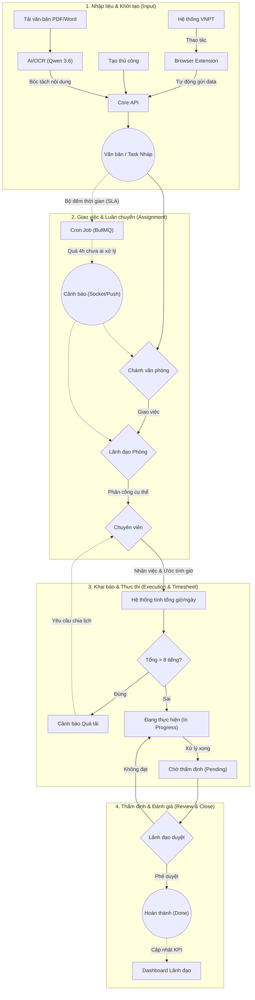
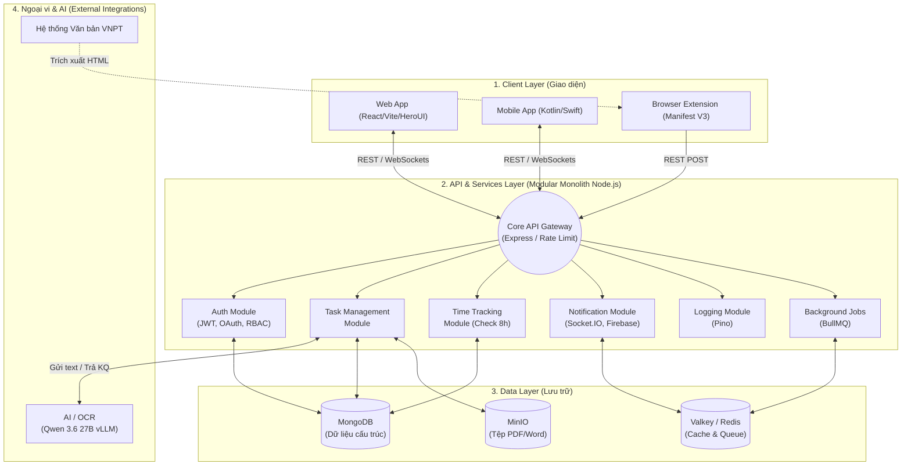

# Tài liệu Phân tích Nghiệp vụ (Business Analysis - BA)

**Dự án:** Hệ thống Quản lý Lịch công tác và Theo dõi Nhiệm vụ Cơ quan
**Phiên bản:** 1.0

---

## 1. Tổng quan dự án (Project Overview)
Hệ thống nhằm số hóa, tự động hóa quy trình giao việc, phân công nhiệm vụ và theo dõi lịch công tác hàng ngày của cán bộ/chuyên viên trong cơ quan nhà nước. Khắc phục tình trạng quên việc, thiếu kiểm soát tiến độ, và tối ưu hóa thời gian thông qua việc tích hợp sâu với hệ thống văn bản điện tử hiện tại (VNPT) và ứng dụng Trí tuệ nhân tạo (AI/OCR).

## 2. Đối tượng người dùng (User Personas)

Hệ thống được thiết kế với 4 vai trò (Role) cốt lõi dựa trên mô hình RBAC (Role-Based Access Control):

| STT | Vai trò (Role) | Chức năng chính |
|---|---|---|
| 1 | **Chánh văn phòng** | Tiếp nhận văn bản đầu vào, luân chuyển/giao việc cấp phòng. Theo dõi tổng thể tiến độ cơ quan. Thẩm định văn bản với sự hỗ trợ của AI. |
| 2 | **Lãnh đạo UBND xã** | Theo dõi lịch họp. Xem báo cáo tổng quan. Giám sát các tiến trình công việc chậm tiến độ hoặc sắp đến hạn. |
| 3 | **Lãnh đạo phòng** | Quản lý trực tiếp khối lượng công việc của phòng. Giao việc cho từng chuyên viên. Xem biểu đồ KPI và báo cáo ngày của nhân viên. |
| 4 | **Chuyên viên** | Nhận việc, xem lịch cá nhân. Khai báo công việc và phân bổ lịch trình (Timesheet). Cập nhật trạng thái hoàn thành. |

## 3. Yêu cầu Chức năng (Functional Requirements - FR)

### FR1: Quản lý Luân chuyển và Giao việc
- **FR1.1 Nhập liệu tự động (Browser Extension):** Extension (Manifest V3) bắt dữ liệu thao tác từ web VNPT (Số ký hiệu, Trích yếu, Hạn xử lý) đẩy về hệ thống.
- **FR1.2 Nhập liệu thủ công:** Cho phép người dùng tự khởi tạo công việc bằng tay.
- **FR1.3 Ứng dụng AI/OCR:** Tự động trích xuất nội dung từ file đính kèm (PDF/Word) để sinh ra Task giao việc một cách thông minh.
- **FR1.4 Phân luồng giao việc:** Chánh văn phòng giao cho Phòng -> Lãnh đạo Phòng giao cho Chuyên viên.

### FR2: Phân loại Nhiệm vụ
Hệ thống bắt buộc phân loại công việc thành 3 nhóm:
- **FR2.1 Giấy mời:** Các sự kiện có giờ/ngày cụ thể, tự động đồng bộ vào Lịch (Calendar).
- **FR2.2 Hạn công việc (Deadline):** Các nhiệm vụ dài hạn/ngắn hạn cần hoàn thành trước thời hạn.
- **FR2.3 Khai báo hàng ngày:** Các công việc phát sinh không tên, mang tính chất cộng dồn hàng ngày.

### FR3: Khai báo Lịch trình và Quản lý Thời gian (Timesheet)
- **FR3.1 Khai báo thời gian:** Chuyên viên tự gán số giờ dự kiến cho từng Task trong ngày.
- **FR3.2 Kiểm soát giới hạn:** Hệ thống cảnh báo "Quá tải" nếu tổng thời gian phân bổ của chuyên viên vượt quá 8 tiếng/ngày.
- **FR3.3 Đánh giá/Thẩm định:** Lãnh đạo có quyền phê duyệt/điều chỉnh thời gian chuyên viên khai báo và đánh giá trực tiếp trên hệ thống.
- **FR3.4 Trạng thái công việc:** Flow chuẩn: `To-Do` -> `In Progress` -> `Done`.

### FR4: Hệ thống Nhắc nhở và Thông báo (Real-time & Cron)
- **FR4.1 Thông báo Real-time:** Bắn thông báo (Socket.IO/Push Notification) khi có việc mới được giao, đảm bảo tức thời không cần tải lại trang.
- **FR4.2 Cảnh báo SLA tự động (Lơ việc):** Hệ thống tự động gửi Alert cho Lãnh đạo nếu văn bản chuyển về phòng quá một thời hạn nhất định (VD: 4 tiếng) mà chưa được giao cho cá nhân nào xử lý.
- **FR4.3 Nhắc việc trễ hạn:** Hiển thị cảnh báo trực quan (màu đỏ) đối với các Task trễ hẹn trên Dashboard Lãnh đạo.

### FR5: Tiện ích AI
- **FR5.1 Hỗ trợ Thẩm định:** Tích hợp AI (Qwen 3.6 27B vLLM) để rà soát lỗi chính tả, check ngữ pháp và tóm tắt ý chính của các văn bản trước khi phát hành.

## 4. Yêu cầu Phi chức năng (Non-Functional Requirements - NFR)

- **NFR1 - Đa nền tảng:** Đồng bộ trải nghiệm giữa Web (tác vụ quản trị, nhập liệu phức tạp) và Mobile App (theo dõi lịch, nhận Push Notification).
- **NFR2 - Tính bảo mật & Riêng tư (Security & Privacy):** Mọi dữ liệu (File, AI) xử lý On-premise. Tích hợp JWT, Google OAuth, 2FA. Áp dụng Rate Limit (Token Bucket) chống DDOS/Brute-force.
- **NFR3 - Hiệu suất & Thời gian thực:** Dashboard phải load cực nhanh với Valkey(Redis). Push Message mượt mà với Socket.IO. Ghi log hệ thống qua Pino mà không ảnh hưởng tới I/O.

## 5. Quy tắc Nghiệp vụ (Business Rules - BR)

- **BR01 - Quy tắc Định mức thời gian:** Tổng định mức công việc trong 1 ngày làm việc của một cá nhân **tuyệt đối không được lớn hơn 8 giờ**. Nếu 1 Task tốn nhiều hơn 8h (Ví dụ làm báo cáo 15 tiếng), phải chia nhỏ thành nhiều ngày khác nhau.
- **BR02 - Quy tắc Phân quyền (RBAC):** Người dùng chỉ nhìn thấy công việc và báo cáo trong phạm vi quyền hạn của mình. (Lãnh đạo phòng A không được xem việc của Lãnh đạo phòng B).
- **BR03 - Quy tắc Giao việc:** Chỉ người có vai trò bằng hoặc cao hơn trong sơ đồ tổ chức mới được quyền gán (assign) việc cho người khác. Cấp dưới không được giao việc cho cấp trên.

## 6. Sơ đồ Luồng Nghiệp Vụ (Workflow Diagram)

Sơ đồ mô tả chi tiết luồng chạy của dữ liệu (Data & Business Flow) từ khi một công việc được sinh ra, được giao phó, cho đến khi hoàn thành và thẩm định:

**Giải thích các khối chính trong Sơ đồ:**
1. **Khối 1 (Nhập liệu):** Hỗ trợ tới 3 nguồn tạo việc (Auto qua Extension, Thủ công, và AI tự đọc file PDF).
2. **Khối 2 (Giao việc):** Cấu trúc phân quyền chặt chẽ. Đặc biệt có bộ đếm thời gian thực (SLA Cron) để bắn cảnh báo đỏ nếu văn bản bị "ngâm" quá lâu tại phòng.
3. **Khối 3 (Khai báo):** Tích hợp quy tắc nghiệp vụ 8 tiếng/ngày. Nếu chuyên viên nhận việc mà cộng dồn ngày hôm đó vượt 8h, hệ thống sẽ chặn và yêu cầu sắp xếp lại.
4. **Khối 4 (Thẩm định):** Lãnh đạo kiểm duyệt lại kết quả. Chỉ khi Lãnh đạo phê duyệt, công việc mới thực sự "Hoàn thành" và tính vào KPI.

## 7. Sơ đồ Kiến trúc Hệ thống (System Architecture Diagram)

Dưới đây là sơ đồ mô tả cấu trúc các thành phần công nghệ (Tech Stack) và cách chúng giao tiếp với nhau trong hệ thống Modular Monolith:

## 8. Công nghệ Đề xuất (Tech Stack)

Để đáp ứng các yêu cầu phi chức năng (NFR) về bảo mật, hiệu suất và khả năng bảo trì, hệ thống sử dụng bộ công nghệ sau (áp dụng kiến trúc **Modular Monolith** kết hợp **Turborepo**):

- **Frontend (Web):** React (Vite, TSX), HeroUI, Tailwind CSS.
- **Frontend (Mobile):** Kotlin (Android) và Swift (iOS).
- **Browser Extension:** JavaScript (Manifest V3).
- **Backend:** Node.js (Express, TypeScript).
- **Database:** MongoDB (Mongoose).
- **Cache & Queue:** Valkey (BullMQ).
- **DevOps:** Docker, PM2, Nginx.
- **Security:** Helmet, CORS, Zod (Data Validation), JWT, Google OAuth, 2FA, Rate Limit (Token Bucket).
- **Authorization:** RBAC (Role-Based Access Control).
- **Real-time & Notifications:** Socket.IO (Web/Extension) và Firebase/APNs (Mobile).
- **Logging:** Pino.
- **Storage:** MinIO.
- **AI / OCR:** Qwen 3.6 27B (vLLM).
